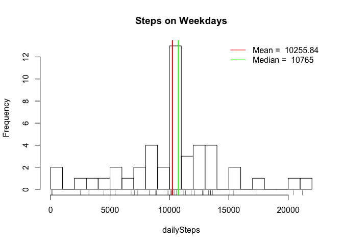
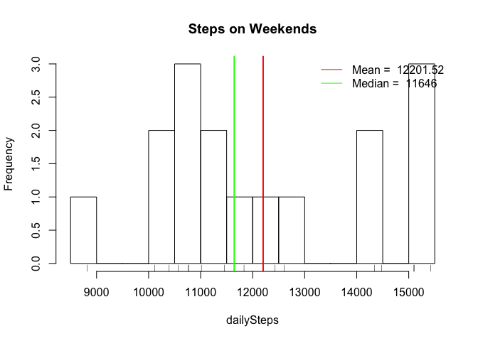

# Reproducible Research: Peer Assessment 1
Linda Kukolich  
January 10, 2015  


*This introduction and descripton of the data is copied from the homework assignment found at* [https://github.com/rdpeng/RepData_PeerAssessment1/blob/master/README.md]

## Introduction

It is now possible to collect a large amount of data about personal
movement using activity monitoring devices such as a
[Fitbit](http://www.fitbit.com), [Nike
Fuelband](http://www.nike.com/us/en_us/c/nikeplus-fuelband), or
[Jawbone Up](https://jawbone.com/up). These type of devices are part of
the "quantified self" movement -- a group of enthusiasts who take
measurements about themselves regularly to improve their health, to
find patterns in their behavior, or because they are tech geeks. But
these data remain under-utilized both because the raw data are hard to
obtain and there is a lack of statistical methods and software for
processing and interpreting the data.

This assignment makes use of data from a personal activity monitoring
device. This device collects data at 5 minute intervals through out the
day. The data consists of two months of data from an anonymous
individual collected during the months of October and November, 2012
and include the number of steps taken in 5 minute intervals each day.

## Data

The data for this assignment can be downloaded from the course web
site:

* Dataset: [Activity monitoring data](https://d396qusza40orc.cloudfront.net/repdata%2Fdata%2Factivity.zip) [52K]

The variables included in this dataset are:

* **steps**: Number of steps taking in a 5-minute interval (missing
    values are coded as `NA`)

* **date**: The date on which the measurement was taken in YYYY-MM-DD
    format

* **interval**: Identifier for the 5-minute interval in which
    measurement was taken


The dataset is stored in a comma-separated-value (CSV) file and there
are a total of 17,568 observations in this
dataset.


## Loading and preprocessing the data
File was downloaded from [https://github.com/rdpeng/RepData_PeerAssesment1/blob/master/activity.zip] on January 10, 2015. The version of the respository used has SHA hash 80edf39c3bb508fee88e3394542f967dd3fd3270. activity.zip was last modified February 11, 2014.


```r
# read the activity file
activityFile <- "activity.csv"
if (! file.exists(activityFile)) {
  # If the file does not exist, unzip it from the compressed version
  compressedFile <- "activity.zip"
  if (! file.exists(compressedFile)) {
    # If the compressed version does not exist, download it
    fileUrl <- "https://d396qusza40orc.cloudfront.net/repdata%2Fdata%2Factivity.zip"
    print("downloading activity.zip")
    download.file(url = fileUrl, destfile = compressedFile, method = "curl", quiet = TRUE)
    dateDownloaded <- date()
    print(dateDownloaded)
  }
  print(paste("unziping", compressedFile))
  unzip(compressedFile)
}
```

```
## [1] "downloading activity.zip"
## [1] "Sat Jan 10 18:00:10 2015"
## [1] "unziping activity.zip"
```

```r
print(paste("reading", activityFile))
```

```
## [1] "reading activity.csv"
```

```r
activityFrame <- read.csv(activityFile, header=TRUE)

activityFrame$date <- as.Date(activityFrame$date)
```

## What is mean total number of steps taken per day?
For this part of the assignment, you can ignore the missing values in the dataset.

1. Make a histogram of the total number of steps taken each day
2. Calculate and report the mean and median total number of steps taken per day

```r
dailySteps <- function(AF, title="Histogram of dailySteps") {
  dailyActivity <- split(AF, AF$date)
  dailySteps <- sapply(dailyActivity, function(x)sum(x$steps, na.rm=TRUE), simplify=TRUE, USE.NAMES=FALSE)
  meanDailySteps <- mean(dailySteps)
  meanDailySteps
  medianDailySteps <- median(dailySteps)
  medianDailySteps

  hist(dailySteps, breaks = 20, main=title)
  rug(dailySteps)
  abline(v = meanDailySteps, lwd = 2, col = "red")
  abline(v = medianDailySteps, lwd = 2, col = "green")
  legend("topright", col = c("red", "green"), legend = (c(paste("Mean = ", 0.01*(meanDailySteps %/% 0.01)), paste("Median = ", medianDailySteps))), lty = 1, box.lty=0)
  sqrt(var(dailySteps))
}
sdDailySteps <- dailySteps(activityFrame)
```

 

Above is a histrogram showing how often the subject took a given number of steps as recorded in our data set. On average, the subject takes about 9354 steps per day, with a median value of 10395.

## What is the average daily activity pattern?
1. Make a time series plot (i.e. type = "l") of the 5-minute interval (x-axis) and the average number of steps taken, averaged across all days (y-axis)

```r
fiveMinuteActivity <- split(activityFrame, activityFrame$interval)
fiveMinuteSteps <- sapply(fiveMinuteActivity, function(x)mean(x$steps, na.rm=TRUE))
fiveMinuteMedianSteps <- sapply(fiveMinuteActivity, function(x)median(x$steps, na.rm=TRUE))
plot(fiveMinuteSteps, xaxt="n", type="l", xlab="Time Interval", main="Mean of steps for 5 minute intervals across days", ylab="Number of Steps")
xticks <- seq(49, 250, by=24)
axis(1, at = xticks, labels=names(fiveMinuteSteps[xticks]))
points(which.max(fiveMinuteSteps), max(fiveMinuteSteps), col="red")
legend("topright", pch=1, col=c("red", "transparent"), legend = c(paste("Maximum Value", 0.01 * max(fiveMinuteSteps) %/% 0.01), paste("at", names(which.max(fiveMinuteSteps)))))
```

 

```r
# Show the median values. This was used in selecting a strategy in question 2
if (FALSE) {
  lines(fiveMinuteMedianSteps, col="blue", type="l")
  legend("topleft", lty=1, col=c("black", "blue"), legend = c("Mean values", "Median values"))
  }
```

2. Which 5-minute interval, on average across all the days in the dataset, contains the maximum number of steps?

```r
which.max(fiveMinuteSteps)
```

```
## 835 
## 104
```
The most active time of day is between about 8:00 and 9:00 AM. The peak activity is between 8:35 and 8:40 AM, which has an average of about 206 steps in those 5 minutes.

## Imputing missing values
Note that there are a number of days/intervals where there are missing values (coded as NA). The presence of missing days may introduce bias into some calculations or summaries of the data.

1. Calculate and report the total number of missing values in the dataset (i.e. the total number of rows with NAs)


```r
paste("missing values", sum(is.na(activityFrame$steps)))
```

```
## [1] "missing values 2304"
```

There are 2304 missing values in the table.

2. Devise a strategy for filling in all of the missing values in the dataset. The strategy does not need to be sophisticated. For example, you could use the mean/median for that day, or the mean for that 5-minute interval, etc.

```r
paste("Daily Steps taken from mean five minute values", sum(fiveMinuteSteps))
```

```
## [1] "Daily Steps taken from mean five minute values 10766.1886792453"
```

```r
paste("Daily Steps taken from median five minute values", sum(fiveMinuteMedianSteps))
```

```
## [1] "Daily Steps taken from median five minute values 1141"
```

The median values for five minute intervals result in a total number of steps per day which is much lower than either the mean or median values for actual whole days. I will replace missing values with the means from each five minute interval, which seems to be a more accurate representation of an average day.

3. Create a new dataset that is equal to the original dataset but with the missing data filled in.


```r
activityNoNA <- activityFrame
activityNoNA$steps <- mapply(function(df, five){if(is.na(df)){five}else{df}}, activityNoNA$steps, fiveMinuteSteps)
```

4. Make a histogram of the total number of steps taken each day and Calculate and report the mean and median total number of steps taken per day. Do these values differ from the estimates from the first part of the assignment? What is the impact of imputing missing data on the estimates of the total daily number of steps?


```r
activityNoNA <- activityFrame
activityNoNA$steps <- mapply(function(df, five){if(is.na(df)){five}else{df}}, activityNoNA$steps, fiveMinuteSteps)
sdDailyNoNA <- dailySteps(activityNoNA, title="Steps per Day, imputing NA values")
```

 

The original mean was 9354 steps per day, and the original median was 10395. Replacing missing values with the mean value for the given time of day increased the mean and median, with both being about 10766. Interestingly, because we have introduced non-integer numbers of steps, the median value is no longer an integer. In terms of the histogram, there are many fewer "zero activity" days. These days have been replaced with "average" days, which has greatly increased the number of average days. The increase in height on in the histogram bin containing the average makes the variability of the data appear to be less. We have improved the mean at the cost of having a good sense of our standard deviation.

```r
print(paste("Standard deviation of original daily step count", sdDailySteps))
```

```
## [1] "Standard deviation of original daily step count 5405.89509515135"
```

```r
print(paste("Standard deviation of daily step count with imputed data", sdDailyNoNA))
```

```
## [1] "Standard deviation of daily step count with imputed data 3974.39074599954"
```
## Are there differences in activity patterns between weekdays and weekends?
For this part the weekdays() function may be of some help here. Use the dataset with the filled-in missing values for this part.

1. Create a new factor variable in the dataset with two levels -- "weekday" and "weekend" indicating whether a given date is a weekday or weekend day.

```r
activityNoNA$partOfWeek <- sapply(activityNoNA$date, function(x)if(weekdays(x) %in% c("Saturday", "Sunday"))"weekend" else "weekday")
```
2. Make a panel plot containing a time series plot (i.e. type = "l") of the 5-minute interval (x-axis) and the average number of steps taken, averaged across all weekday days or weekend days (y-axis). The plot should look something like the following, which was created using simulated data:

```r
  weekdayFrame <- subset(activityNoNA, activityNoNA$partOfWeek == "weekday")
  weekendFrame <- subset(activityNoNA, activityNoNA$partOfWeek == "weekend")
  layout(matrix(c(1,2), 2, 1, byrow = TRUE))
  par(oma=c(2, 2, 0, 0))
  # bottom, left, top, right
  par(mar=c(0, 2, 1, 2))
  weekdayActivity <- split(weekdayFrame, weekdayFrame$interval)
  weekdaySteps <- sapply(weekdayActivity, function(x)mean(x$steps, na.rm=TRUE))
 
  xticks <- seq(49, 250, by=24)
  yticks <- seq(0, 200, by=50)
  
  plot(weekdaySteps, ylab="", yaxt="n", xaxt="n", type="l", xlab="", main="weekday")
  axis(3, at = xticks, labels=FALSE)
  axis(4, at = yticks)
  axis(2, at = yticks, labels=FALSE)
  
  weekendActivity <- split(weekendFrame, weekendFrame$interval)
  weekendSteps <- sapply(weekendActivity, function(x)mean(x$steps, na.rm=TRUE))
  par(mar=c(2, 2, 1, 2))
  plot(weekendSteps, ylab="", yaxt="n", xaxt="n", type="l", main="weekend", xlab="")
  axis(1, at = xticks, labels=names(weekendSteps[xticks]))
  axis(2, at = yticks)
  axis(4, at = yticks, labels=FALSE)
  mtext("Number of Steps", side = 2, line = 0, outer=TRUE)
  mtext("Time Interval", side = 1, line=0, outer=TRUE)
```

 

```r
  print(paste("Average Steps on Weekdays", sum(weekdaySteps)))
```

```
## [1] "Average Steps on Weekdays 10255.8473794549"
```

```r
  print(paste("Average Steps on Weekends", sum(weekendSteps)))
```

```
## [1] "Average Steps on Weekends 12201.5235849057"
```

The pattern of activity on weekdays differs from that on weekends. On the weekend, there is a larger number of steps taken, on average, than on weekdays. However, on weekdays, most of the steps are taken at a particular time. It appears as though the person who generated this data has a regular workout on weekday mornings, and is then less active through the rest of the day. Conversely, there is no clear schedule of activity on weekends, but there is generally more activity then.

The following two histrograms show this difference in the weekend and weekday daily step totals.

```r
print(paste("Standard deviation of daily step totals for weekdays", dailySteps(weekdayFrame, title="Steps on Weekdays")))
```

 

```
## [1] "Standard deviation of daily step totals for weekdays 4364.07467512351"
```

```r
print(paste("Standard deviation of daily step totals for weekends", dailySteps(weekendFrame, title="Steps on Weekends")))
```

 

```
## [1] "Standard deviation of daily step totals for weekends 2082.90269681637"
```

The subject has a higher number of "average" days on (12 of the 61 days) weekdays, and a lower number of inactive days (5000 steps or less) on weekends.
